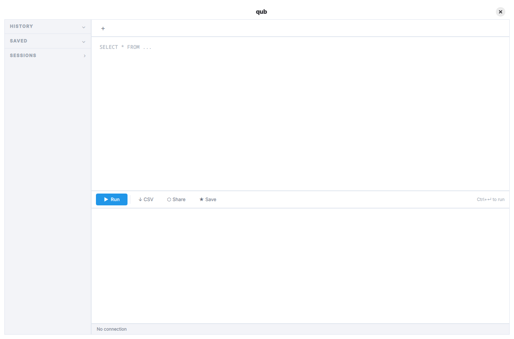

# qub


[](https://github.com/ajunior/qub/actions/workflows/ci.yml)

The SQL editor I built because I needed it. Shared because you might too.

Connect to multiple databases, run queries, browse your history, and share live results with a link.

## Why qub exists

My enterprise DataGrip license got canceled. Not the first time. I looked around and nothing fit — DBeaver and the others are fine tools, but they feel bloated for the way I work, and I never got comfortable with their interfaces.

So I wrote my own. I thought about what I actually use in a SQL editor, what I can live without, and what kind of interface I enjoy looking at all day. Then I built that.

I'm sharing it in case someone else is in the same spot I was.

AI helped write the code. Every feature, every decision, and every line of code is reviewed by me.



## Features

**Connections**

- **Multi-connection** — PostgreSQL, MySQL, MariaDB, SQLite, Oracle, Firebird, and ODBC, all open at once
- **Docker discovery** — pick a running database container and the connection form fills itself in from it
- **SSH tunnels and TLS** — reusable tunnel definitions, per-connection certificates
- **Profiles** — named safety rule sets (read-only, destructive-query guards) you assign per connection

**Writing SQL**

- **Schema-aware autocomplete** — columns of the tables actually in scope, including through aliases
- **Query parameters** — `:name` and `$1` placeholders prompt for values, typed and remembered per tab
- **AI assistant** — generate SQL from plain language via Ctrl+K or inline `/* @ai */` blocks (Anthropic, OpenAI, Ollama)
- **Markdown blocks** — `/* @md */` turns a query file into a literate document with a live preview
- **Command palette** — Ctrl+P reaches every action in the workspace

**Reading results**

- **Analyze in place** — every result set also opens as a chart, a per-column profile, a pivot table, a query plan, data-quality checks, or a diff against an earlier run
- **Navigate the data** — expand a cell or a whole row, and jump along foreign keys into a new tab
- **Export** — CSV, TSV, JSON, Excel, Markdown, or SQL `INSERT`s, never capped by the display limit
- **Import CSV** — build a SQLite database from delimited text, then join across files with plain SQL

**Around the database**

- **Query history** — every execution is logged and searchable from the sidebar
- **Snippets** — save SQL by name and folder, insert it at the cursor, share it as JSON
- **Workspaces** — named work environments with their own tabs and allowed connections, restored as you left them
- **Health and drift** — live database metrics with threshold alerts, schema snapshots, and schema-to-schema comparison
- **Live share** — a token-protected link that streams live query results to any browser on your network
- **Themes** — four built-in, full palette customization, import and export as JSON

## Security

Live share and multi-connection raise fair questions about where your data goes. Here is what qub does:

- **Passwords go to the system keychain**, not to disk. qub uses the OS keychain (Keychain on macOS, Secret Service on Linux, Credential Manager on Windows) and never writes credentials itself. Expect your system to ask about it: macOS shows a keychain prompt the first time a saved password is read — and again after each update, since the permission is tied to that build — and a Linux desktop asks to unlock the keyring if it is not already unlocked at login. Windows does not prompt.
- **Live share links are token-protected.** No token, no access.
- **Nothing leaves your machine unless you share it.** The live share server is local. There is no telemetry, no cloud, no external service.

## Requirements

| Dependency | Version | Notes |
|---|---|---|
| [Qt](https://www.qt.io/download) | 6.4 or later | Core, Quick, QuickControls2, QuickDialogs2, Sql, Network, Concurrent, WebSockets, HttpServer (plus Test and Qml to build the tests) |
| CMake | 3.21 or later | |
| C++ compiler | C++17 | GCC 10+, Clang 12+, or MSVC 2019+ |
| OpenSSL | any | Required; used for the live-share server's TLS |
| libsecret | any | Linux only (`libsecret-devel` on Fedora/RHEL, `libsecret-dev` on Debian/Ubuntu) |

### Database drivers

Each driver is a Qt plugin that loads a vendor client library at connect time,
so a driver is only usable where both the plugin and that library exist —
otherwise the connection fails with *"The … driver could not be loaded"*.

Which plugins exist is decided by Qt, not by qub: Qt's official macOS and
Windows binaries carry no MySQL driver at all, and the macOS ones carry no
Oracle or Firebird driver either. The release packages then bundle every client
library they can, so what is left is what a user has to install.

| | Linux (AppImage) | macOS (DMG) | Windows (installer) |
|---|---|---|---|
| SQLite | bundled | bundled | bundled |
| PostgreSQL | bundled | bundled | bundled |
| ODBC | bundled | bundled | system |
| MySQL / MariaDB | bundled | *no plugin* | *no plugin* |
| Firebird | bundled | *no plugin* | bring `fbclient.dll` |
| Oracle | *not bundled* | *no plugin* | bring [Instant Client](https://www.oracle.com/database/technologies/instant-client.html) |

*No plugin* means nothing you install will help; only a qub built against a Qt
compiled with that driver will. Oracle is left out of the AppImage because its
client is not redistributable.

Building from source, every client library is your system's: `libpq`,
`libmariadb` or `libmysqlclient`, `libfbclient`, `unixODBC`, Instant Client.

[Mahina](https://github.com/ajunior/mahina) (the QML component library qub's UI is built on) and
[qtkeychain](https://github.com/frankosterfeld/qtkeychain) are fetched automatically at build time,
each pinned to a specific commit. To build qub against a local Mahina checkout, put it at `../mahina`
and it is picked up automatically.

## Building

```bash
git clone https://github.com/ajunior/qub.git
cd qub
cmake -S . -B build
cmake --build build --parallel
```

The binary is at `build/qub`.

### Qt not found?

```bash
cmake -S . -B build -DCMAKE_PREFIX_PATH=/path/to/Qt/6.x.x/gcc_64
```

## Running

```bash
./build/qub
```

## Tests

```bash
ctest --test-dir build --output-on-failure
```

Everything CI checks lives in one script, so a red pipeline can be reproduced
locally with one command rather than by reading YAML:

```bash
bash scripts/ci-check.sh
```

It builds, runs the unit tests, exercises the macOS and Windows packagers
against fake `otool`/`dumpbin` output, boots the app headless and requires it to
stay up **and stay silent** (Qt reports a broken QML binding on stderr without
exiting non-zero), then runs `qmllint` against a checked-in ceiling per warning
category. By default it builds against the pinned Mahina commit, the way CI
does; pass `--local-mahina` to use a `../mahina` checkout instead.

There is also a load test, which is not part of the gate because it needs a
graphical stack and several minutes:

```bash
bash scripts/load-test.sh
```

It builds a million-row SQLite database, drives the real UI against it on a
private Xvfb display — typing queries, then opening the chart, profile, pivot
and plan panes over each result — and reports what the process holds after the
last cycle against what it held after the first. Linux only; it reads `/proc`
for the numbers and needs `Xvfb`, `xdotool` and ImageMagick.

## UI

qub's interface is built on top of [Mahina](https://github.com/ajunior/mahina), a QML component library I developed alongside this project. It started with the components qub needed and grew from there.

If you are building a Qt application and looking for a consistent, ready-to-use set of QML components, take a look — it might save you some work.

## Contributing

I'm not taking pull requests for new features. qub is the editor I wanted, and I want to keep it that way.

If you found a bug or want to discuss something, [open an issue](https://github.com/ajunior/qub/issues). I read them.

## License

qub is free software released under the [GNU General Public License v3.0](https://www.gnu.org/licenses/gpl-3.0.html).

See [LICENSE](LICENSE) for the full text.
